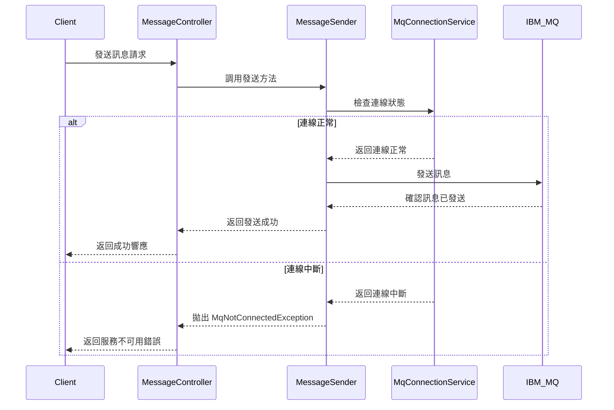
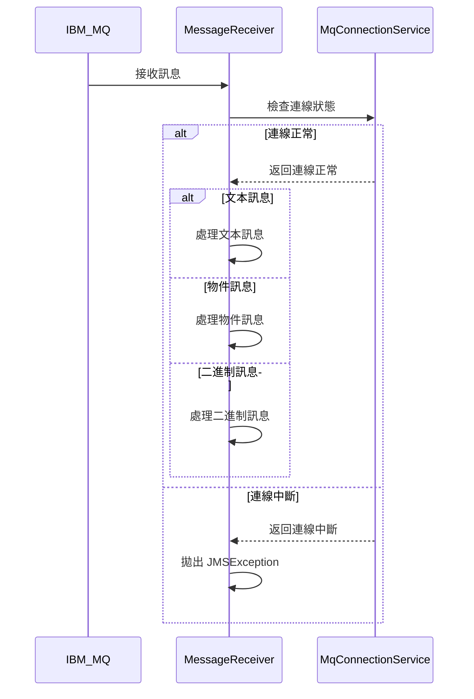
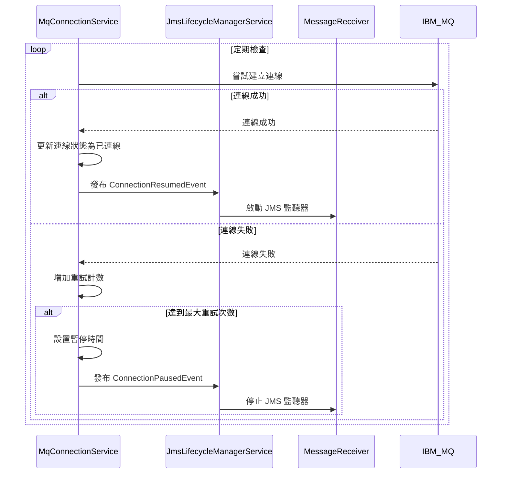
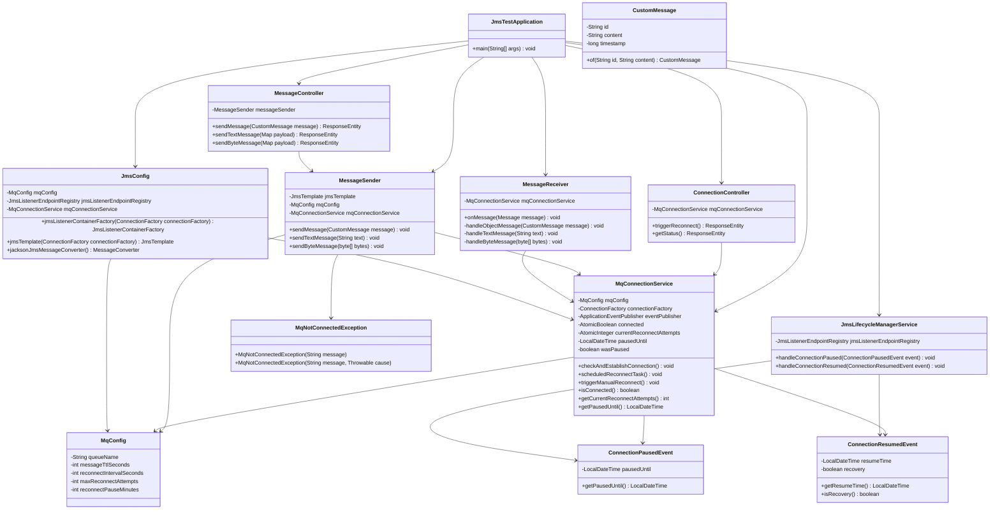

# JMS 測試應用程式規格文件

## 1. 系統概述

JMS 測試應用程式是一個基於 Spring Boot 的 Java 應用程式，用於與 IBM MQ 訊息中介軟體進行交互。該應用程式提供了訊息發送和接收功能，並實現了 MQ 連線中斷時的重新連線機制，確保系統的穩定性和可靠性。

### 1.1 系統目標

- 提供簡單易用的 API 介面，用於發送和接收 JMS 訊息
- 實現 MQ 連線中斷時的自動重新連線機制
- 提供連線狀態監控和管理功能
- 確保訊息處理的可靠性和穩定性

### 1.2 系統架構

應用程式採用標準的 Spring Boot 架構，主要包含以下組件：

- **控制器層**：提供 RESTful API 介面
- **服務層**：實現業務邏輯和 MQ 交互
- **配置層**：提供系統配置和 JMS 配置
- **模型層**：定義數據模型和訊息結構
- **事件層**：定義和處理系統事件

## 2. 功能規格

### 2.1 訊息發送功能

#### 2.1.1 發送自定義物件訊息

- **API 端點**：`POST /api/messages/send`
- **請求格式**：JSON 格式的 CustomMessage 物件
- **回應格式**：JSON 格式的操作結果
- **功能描述**：將自定義物件訊息發送到 MQ 隊列

#### 2.1.2 發送文本訊息

- **API 端點**：`POST /api/messages/send-text`
- **請求格式**：JSON 格式，包含 text 欄位
- **回應格式**：JSON 格式的操作結果
- **功能描述**：將文本訊息發送到 MQ 隊列

#### 2.1.3 發送二進制訊息

- **API 端點**：`POST /api/messages/send-bytes`
- **請求格式**：JSON 格式，包含 Base64 編碼的 data 欄位
- **回應格式**：JSON 格式的操作結果
- **功能描述**：將二進制訊息發送到 MQ 隊列

### 2.2 訊息接收功能

- **實現方式**：使用 @JmsListener 註解的方法
- **監聽目標**：配置的 MQ 隊列
- **處理邏輯**：根據訊息類型分派到不同的處理方法
- **支援的訊息類型**：
  - TextMessage：文本訊息
  - ObjectMessage：自定義物件訊息
  - BytesMessage：二進制訊息

### 2.3 MQ 連線管理功能

#### 2.3.1 連線狀態查詢

- **API 端點**：`GET /api/mq/status`
- **回應格式**：JSON 格式，包含連線狀態、重試次數和暫停時間
- **功能描述**：獲取當前 MQ 連線的狀態信息

#### 2.3.2 手動觸發重新連線

- **API 端點**：`POST /api/mq/reconnect/trigger`
- **回應格式**：JSON 格式的操作結果
- **功能描述**：手動觸發 MQ 重新連線嘗試

### 2.4 MQ 斷線重連機制

- **自動重連**：定期檢查連線狀態，自動嘗試重新連線
- **重連策略**：可配置的重連間隔、最大嘗試次數和暫停時間
- **事件通知**：連線狀態變化時發布事件
- **監聽器管理**：根據連線狀態自動停止和啟動 JMS 監聽器

## 3. 技術規格

### 3.1 開發環境

- **Java 版本**：Java 21
- **框架**：Spring Boot 3.5.0
- **構建工具**：Maven 3.8+
- **訊息中介軟體**：IBM MQ

### 3.2 依賴項

- **spring-boot-starter-web**：Web 應用程式支援
- **spring-boot-starter-actuator**：應用程式監控
- **mq-jms-spring-boot-starter**：IBM MQ 的 Spring Boot 整合
- **spring-boot-starter-validation**：數據驗證
- **lombok**：簡化 Java 程式碼
- **springdoc-openapi-starter-webmvc-ui**：API 文檔生成

### 3.3 配置參數

#### 3.3.1 IBM MQ 連線參數

- **ibm.mq.queue-manager**：MQ 隊列管理器名稱
- **ibm.mq.channel**：MQ 通道名稱
- **ibm.mq.conn-name**：MQ 連線地址和端口
- **ibm.mq.user**：MQ 連線用戶名

#### 3.3.2 應用程式配置參數

- **mq-config.queue-name**：目標隊列名稱
- **mq-config.message-ttl-seconds**：訊息過期時間（秒）
- **mq-config.reconnect-interval-seconds**：重連間隔（秒）
- **mq-config.max-reconnect-attempts**：最大重連嘗試次數
- **mq-config.reconnect-pause-minutes**：重連暫停時間（分鐘）

## 4. 系統流程

### 4.1 訊息發送流程

### 4.2 訊息接收流程

### 4.3 MQ 斷線重連流程

## 5. 類圖

## 6. 錯誤處理

### 6.1 MQ 連線錯誤

- **錯誤類型**：MqNotConnectedException
- **處理方式**：
  - 發送訊息時，如果 MQ 連線中斷，拋出 MqNotConnectedException
  - 控制器層捕獲異常，返回 HTTP 503 (Service Unavailable) 錯誤
  - 自動重連機制嘗試重新建立連線

### 6.2 訊息處理錯誤

- **錯誤類型**：JMSException, Exception
- **處理方式**：
  - 接收訊息時，如果處理失敗，記錄錯誤日誌
  - 根據錯誤類型採取不同的處理策略
  - 如果是 MQ 連線錯誤，JMS 監聽器會自動停止

## 7. 安全考慮

- **連線安全**：支援 IBM MQ 的安全連線機制
- **錯誤處理**：避免在錯誤響應中暴露敏感信息
- **輸入驗證**：對 API 請求進行驗證，防止惡意輸入

## 8. 性能考慮

- **連線池**：使用 IBM MQ 的連線池機制
- **訊息過期**：設置訊息過期時間，避免隊列堆積
- **重連策略**：可配置的重連間隔和暫停時間，避免頻繁重連
